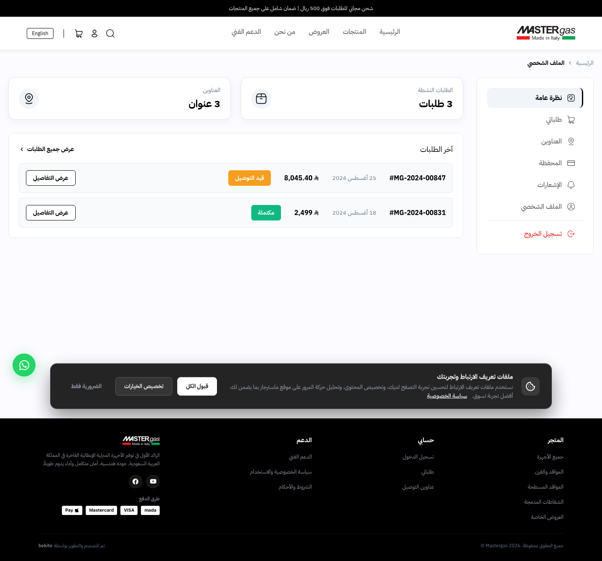
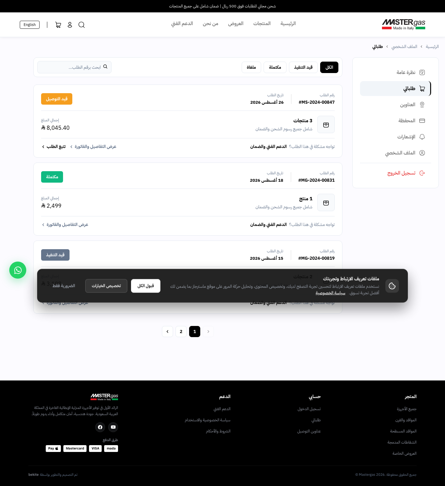
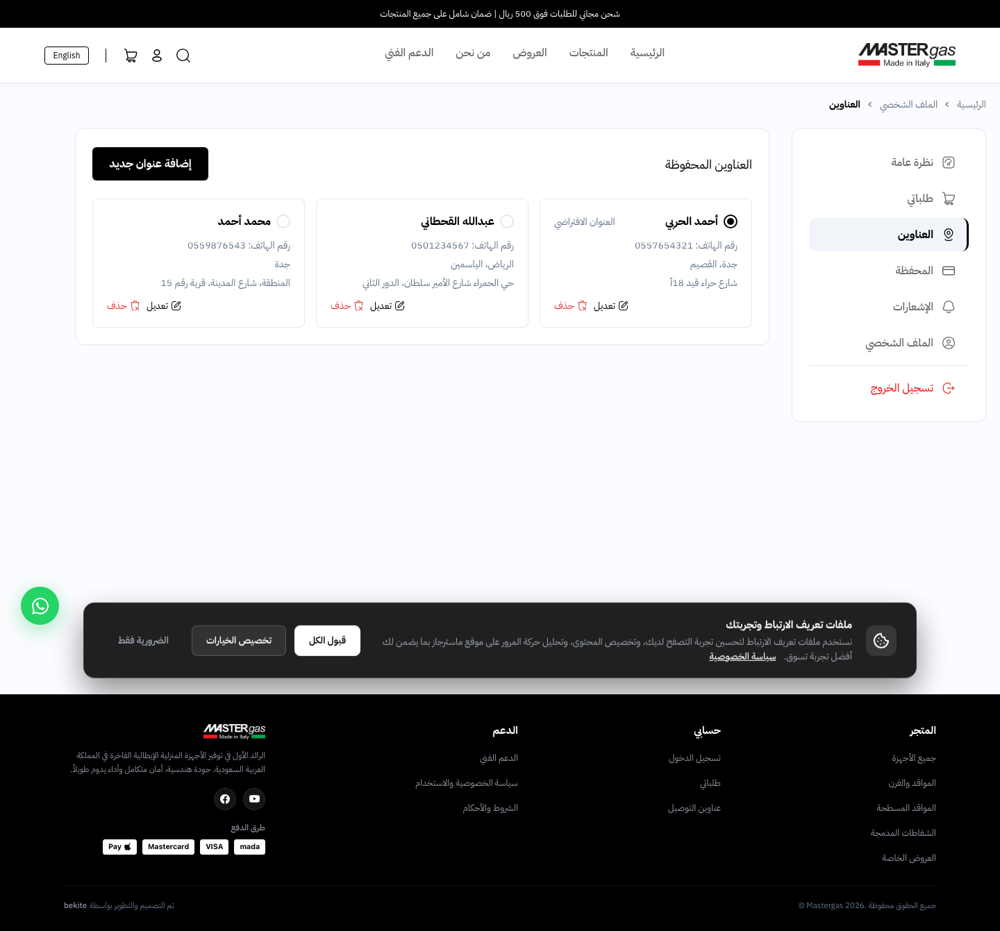
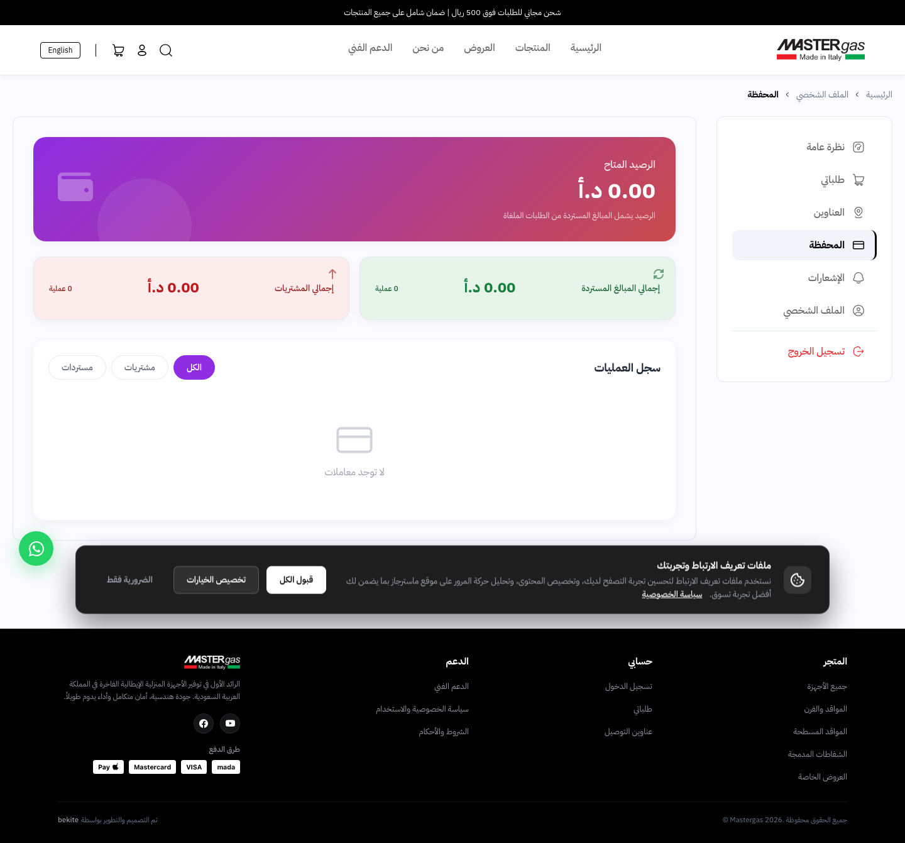
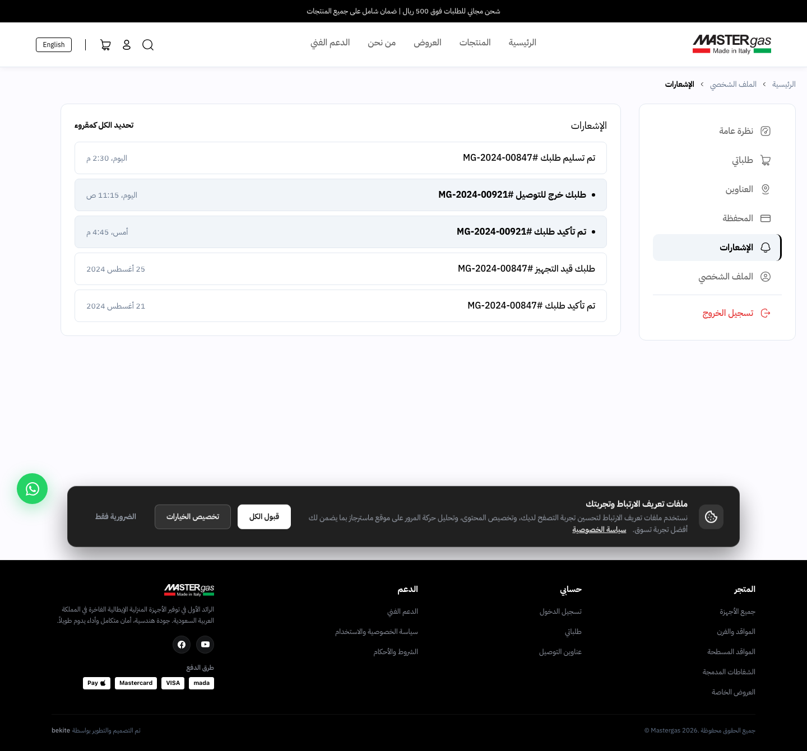
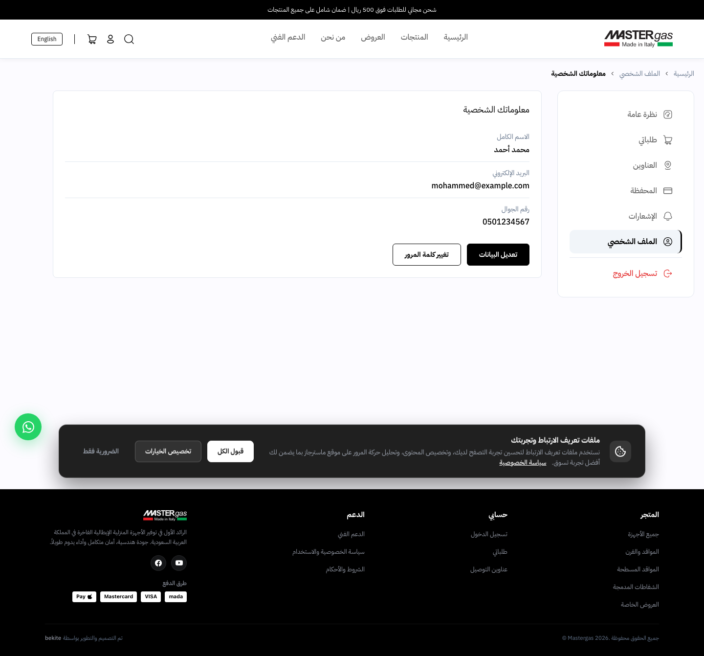
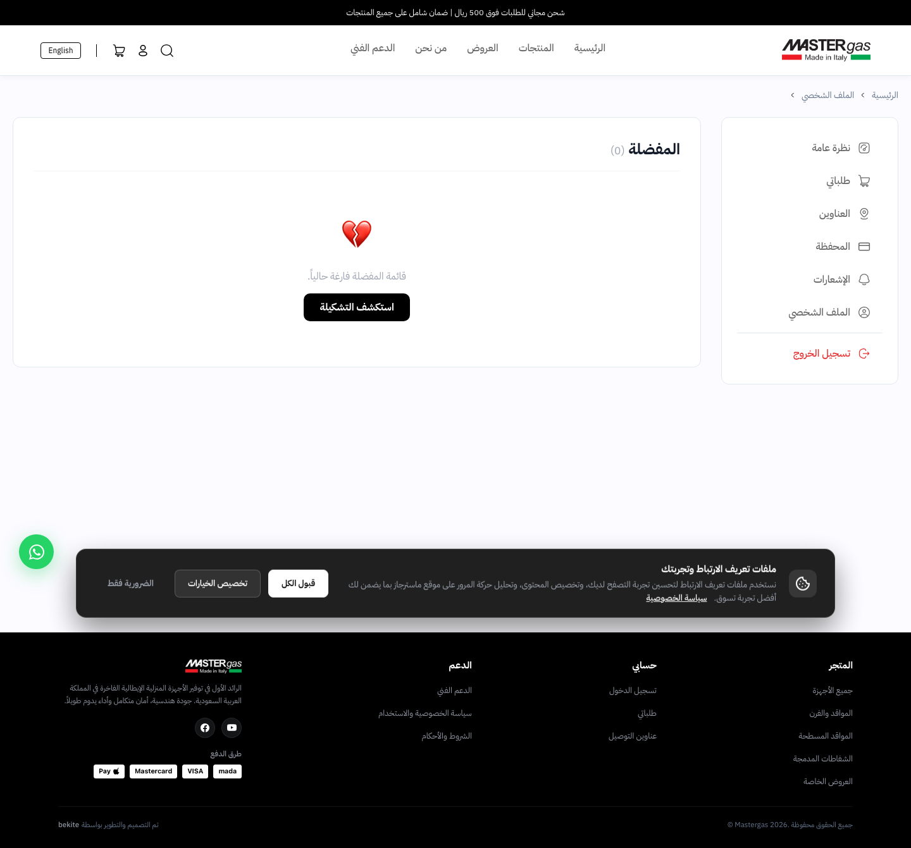
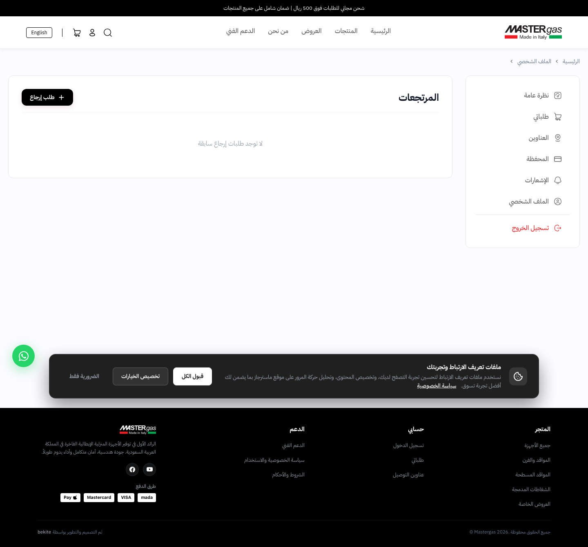
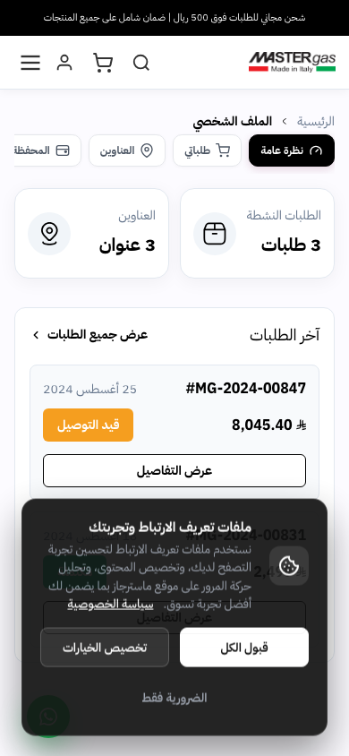
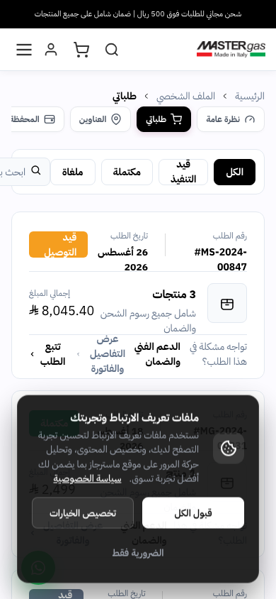

# تقرير شغل اليوم — MasterGas

## Work Report — October 7, 2026

**التاريخ / Date:** 7 أكتوبر 2026 — بتوقيت القاهرة / Cairo time  
**Commit:** `d5932f96a4dd17625144d8b6720dc0190d70649a`  
**Commit message:** `feat: add mock authentication support and static UI assets`  
**التحقق البصري / Visual verification:** تم تشغيل الموقع محليًا وتصوير الواجهة الفعلية / Local app rendered and captured from the actual website

---

## الملخص التنفيذي / Executive Summary

شغل اليوم ركّز على تحويل صفحة حساب العميل إلى Dashboard كاملة قابلة للمعاينة، مع دعم العربية واتجاه RTL، وإضافة أقسام الحساب الأساسية والبيانات التجريبية والأصول البصرية اللازمة.

Today’s work focused on turning the customer profile page into a previewable dashboard with Arabic RTL support, core account sections, mock data, and the required visual assets.

### ما تم إنجازه اليوم / Delivered today

- إعادة بناء واجهة الملف الشخصي كـ Dashboard.
- إضافة Overview بإحصائيات الطلبات النشطة والعناوين وآخر الطلبات.
- إضافة Sidebar وMobile tabs وBreadcrumbs.
- تجهيز صفحات الطلبات، العناوين، المحفظة، الإشعارات، الملف الشخصي، المفضلة، والمرتجعات.
- إضافة بيانات Mock للطلبات والعناوين والإشعارات، مع صور المنتجات داخل الطلبات.
- إضافة `mockAuth=true` لمعاينة الحساب بدون تسجيل دخول حقيقي.
- إضافة مفاتيح ترجمة عربية وإنجليزية جديدة.
- إضافة SVG icons وصور المنتجات المطلوبة للواجهة.

---

## Screenshots من الموقع الفعلي / Screenshots from the actual website

> كل الصور التالية مأخوذة من الموقع بعد تشغيله محليًا على `http://127.0.0.1:5173`، وليست Screenshots للكود.

> All screenshots below were captured from the rendered website at `http://127.0.0.1:5173`, not from source code.

### 1. Overview Dashboard

توضح الشاشة إحصائيات الطلبات النشطة والعناوين، قائمة آخر الطلبات، الـ Sidebar، والـ Breadcrumbs.

The screen shows active-order and address metrics, recent orders, sidebar navigation, and breadcrumbs.

### 2. Orders

توضح شاشة الطلبات حالات الطلبات، أرقام الطلبات، الإجمالي، الحالة، والتفاصيل.

The orders screen shows order numbers, totals, statuses, and detail actions.

### 3. Addresses

توضح العناوين المحفوظة، العنوان الافتراضي، التعديل والحذف، وزر إضافة عنوان جديد.

The addresses screen shows saved addresses, the default address, edit/delete actions, and add-address action.

### 4. Wallet

توضح الرصيد المتاح، إجمالي المشتريات، إجمالي المبالغ المستردة، وفلاتر سجل العمليات.

The wallet screen shows available balance, purchases, refunds, and transaction filters.

### 5. Notifications

تم تجهيز شاشة الإشعارات مع حالات القراءة والعداد والإجراءات المرتبطة بها.

The notifications screen was added with read/unread state, badge count, and related actions.

### 6. Personal Profile

تم تجهيز شاشة الملف الشخصي لعرض البيانات وتعديلها وتغيير كلمة المرور.

The personal profile screen supports viewing/editing profile data and changing the password.

### 7. Wishlist

تم تجهيز شاشة المفضلة داخل حساب العميل.

The customer wishlist screen was added to the account area.

### 8. Returns

تم تجهيز شاشة المرتجعات ونموذج طلب الإرجاع.

The returns screen and return-request flow were added.

### 9. Responsive mobile UI

تم اختبار واجهة Overview والطلبات على مقاس Mobile، مع ظهور tabs الأفقية والتخطيط المتجاوب.

The Overview and Orders pages were checked at mobile size, including horizontal tabs and responsive layout.

---

## تفاصيل الملفات التي اتغيرت / Changed Files

| الملف / File | ما تم عمله / Work completed |
|---|---|
| `src/views/website/ProfileView.vue` | إعادة بناء Dashboard وكل أقسام حساب العميل / Rebuilt the profile dashboard and account sections |
| `src/utils/customerSession.js` | دعم `?mockAuth=true` وإرجاع preview token / Added preview-token support |
| `src/i18n/index.js` | مفاتيح عربية وإنجليزية للـ Overview والطلبات / Added Arabic and English profile labels |
| `assets/*.svg` | أيقونات Dashboard والعناوين والإشعارات / Dashboard, address, and notification icons |
| `src/assets/*.svg` | أيقونات التعديل والحذف / Edit and delete icons |
| `public/images/products/*.jpg` | صور المنتجات المستخدمة في الطلبات التجريبية / Product thumbnails used by mock orders |
| `reports/mastergas-work-report-2026-10-06.docx` | ملف تقرير سابق أُضيف مع الـ commit / Previous report artifact included in the commit |

---

## بيانات Mock المضافة / Mock Data Added

- 4 طلبات تجريبية بحالات مختلفة: قيد التوصيل، مكتملة، وقيد التنفيذ.
- 3 عناوين محفوظة مع عنوان افتراضي.
- إشعارات تجريبية مع حالات مقروء/غير مقروء.
- عناصر منتجات وصور مرتبطة بالطلبات.
- بيانات افتراضية للملف الشخصي عند غياب بيانات المستخدم.

- Four mock orders with delivery, completed, and processing states.
- Three saved addresses with a default address.
- Mock notifications with read/unread states.
- Product items and thumbnails linked to orders.
- Default profile data when live user data is unavailable.

---

## التحقق / Verification

- `npm run build` نجح بدون أخطاء.
- Vite نجح في تحويل 222 module وبناء نسخة production.
- الموقع ظهر بدون صفحة فارغة أو framework error overlay.
- تم تصوير 8 شاشات Desktop وشاشتين Mobile من الواجهة الفعلية.

- `npm run build` passed without compilation errors.
- Vite transformed 222 modules and produced a production build.
- The rendered app was not blank and showed no framework error overlay.
- Eight desktop views and two mobile views were captured from the rendered UI.

### ملاحظة QA / QA note

أثناء تجربة الضغط على رابط الطلبات من Overview، تم التحويل إلى `/?openAuth=true` بدل فتح تبويب الطلبات مباشرة. لذلك تم تصوير شاشة الطلبات من الرابط المباشر `profile?mockAuth=true&tab=orders`، وهي ظهرت بشكل صحيح. كما ظهرت تحذيرات i18n متكررة عن المفتاح `nav.search`، وهي تحتاج تنظيفًا لاحقًا.

When clicking the Orders link from Overview, the app redirected to `/?openAuth=true` instead of opening the Orders tab directly. The Orders screenshot was therefore captured from the direct route `profile?mockAuth=true&tab=orders`, which rendered correctly. Repeated i18n warnings for the missing `nav.search` key were also observed and should be cleaned up later.

---

## النتيجة / Result

تم توثيق شغل اليوم من الواجهة الفعلية للموقع داخل هذا التقرير، مع إدراج كل الشاشات الرئيسية التي تم تنفيذها، وليس Screenshots للكود.

Today’s work is documented using screenshots from the actual rendered website, covering the implemented account-dashboard screens rather than source-code screenshots.

**التقرير مكتمل / Report complete.**
